# BitPass


[](https://bitpass-app.herokuapp.com)

Frontend URL: <a href="https://bitpass-app.herokuapp.com" target="_blank">https://bitpass-app.herokuapp.com</a>

Backend URL: <a href="https://bitpass-server.herokuapp.com" target="_blank">https://bitpass-server.herokuapp.com</a>

### General Information

Bitpass is an open source password manager opereting on a zero-knowledge security model. 

The project consists of a RESTful web service with .NET and (responsive) single page application with React.


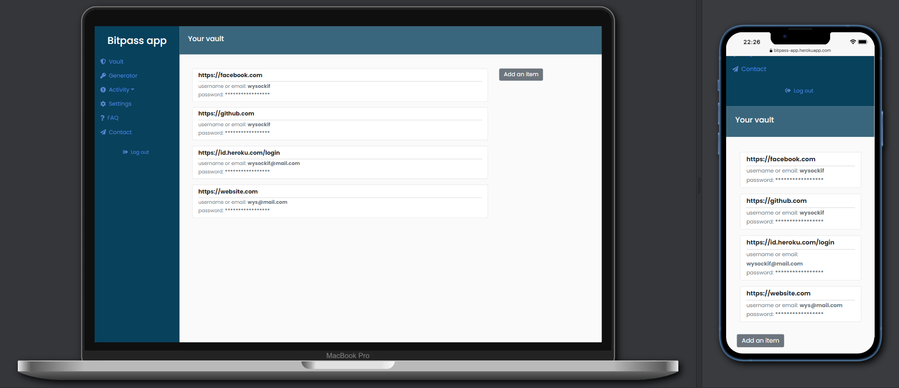

The app allows users to:
* register (with account activation via e-mail) and login,
* save the encrypted passwords,
* show/copy the decrypted passwords,
* see the account activities,
* see the active sessions and logout of all sessions,
* change/reset the password,
* generate a new password.


---
### Used Technologies

1. Database:
- `PostgreSQL 13.2`
- `Heroku PostgreSQL 13.5`

2. Back-end:
- `C# 9`
- `.NET 5`

3. Front-end:
- `Typescript 4.1.2`
- `React.js 17.0.2`

4. DevOps and deployment:
- `Heroku`
- `Docker 20.10.11`
- `Docker Compose 2.2.1`

---

### Security

Bitpass employs a "zero-knowledge" policy. The passwords, master password and encryption key are never received in plain text on the server - it is possible by encrypting the vault passwords and hashing the encryption key before ever leaving the browser. Having the encrypted passwords without the encryption key prevents the decryption on the server. The encryption key is derived from the master password using Password-Based Key Derivation Function 2 (PBKDF2) - it makes it harder for someone to guess the encryption key through a brute-force attack.


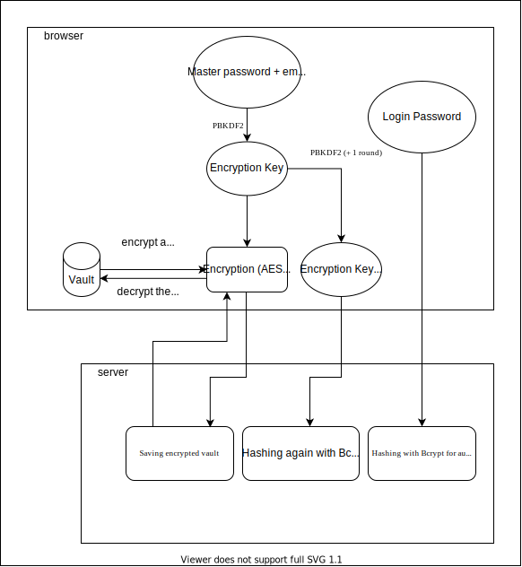

Used algorithms:

* <a href="https://github.com/brix/crypto-js/blob/develop/src/aes.js" target="_blank">AES 256-bit</a> - encryption,
* <a href="https://github.com/crypto-browserify/pbkdf2" target="_blank">PBKDF2</a> (with salt) - encryption key derivation,
* <a href="https://github.com/BcryptNet/bcrypt.net" target="_blank">BCrypt</a> (with salt and pepper) - hashing.


The app uses JSON Web Tokens for Authentication. Access tokens are valid for 1 minute. Refresh tokens are valid for 3 hours. The app implements also login delays and limits of invalid login attempts.


---
### Requirements

To run the application locally you need:

* `Docker 19.03.13`
* `Docker-compose  1.25.0`
* `.NET 5`
* `NodeJS`

Supported browsers:
<p float="left">
    
    
    
    
    
    
</p>


The project uses the latest version (17.0.2) of React. You can refer to the  <a href="https://reactjs.org/docs/react-dom.html#browser-support" target="_blank">React documentation</a> for more information about supported browsers.

---
### Setup & usage

To use the deployed app <a href="https://bitpass-app.herokuapp.com" target="_blank">click here</a>.

To run it locally follow the instructions:

0. Clone this repo to your desktop:

    ```sh
    git clone git@github.com:wysockif/bitpass.git
    ```
1. Database:

    Change your directory to `bitpass/database` and enter:

    ```sh
    docker-compose up database
    ```

    It will set up a database (PostgreSQL) server on port 5432.

2. Back-end:

    Create `appsettings.Development.json` file as in <a href="https://github.com/wysockif/bitpass/blob/main/server/src/Api/appsettings.Example.json" target="_blank">appsettings.Example.json</a>.

    Change your directory to `bitpass\server\src\Api` and enter:

    ```bash
    dotnet dev-certs https --trust
     ```
    
    then:

    ```bash
    dotnet run
     ```

     It will run the back-end app on port 5001 via https. Trust the certificate in your browser.

3. Front-end: 
    Change your directory to `bitpass\client` and enter:
    ```bash
    yarn install
    ```
    then: 

    ```bash
    yarn start
    ```

    It will run the front-end app on port 3000 via https. Trust the certificate in your browser.

---
### Screenshots

* Sign up

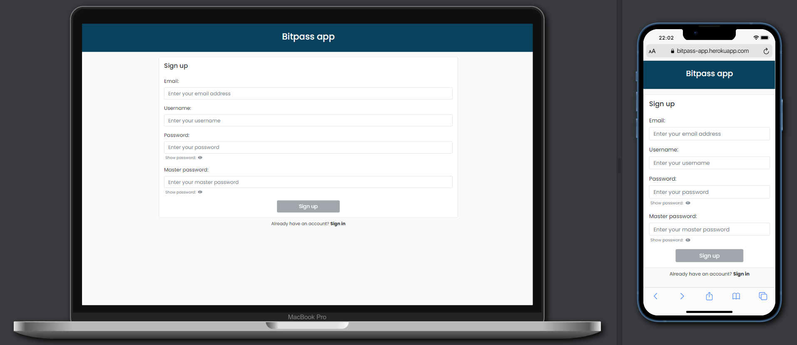

* Sign in


* Request reset your password

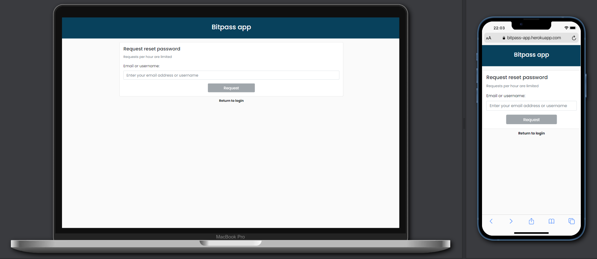

* Verify your master password

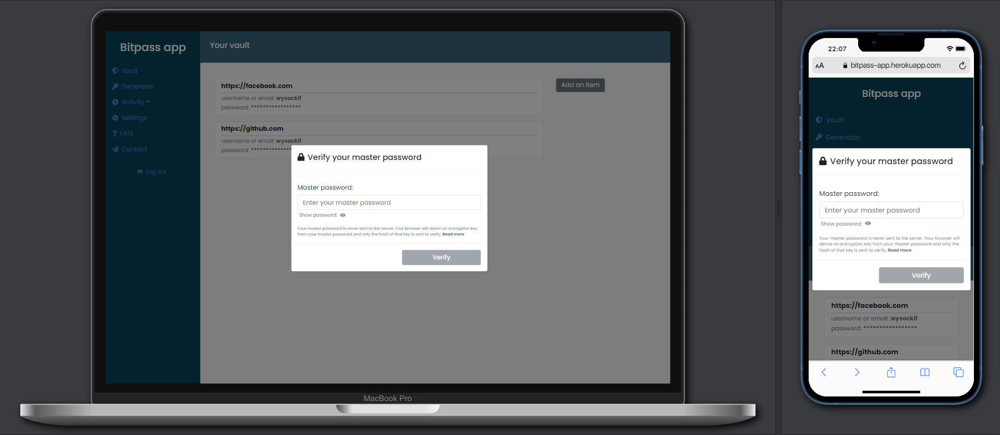

* Add a new item

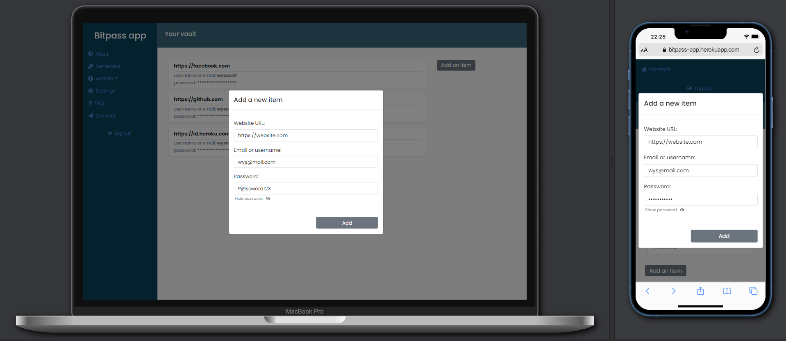

* Vault


* Reveal the password

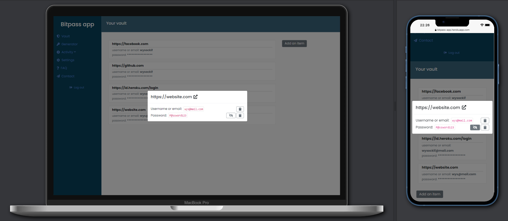

* Password generator

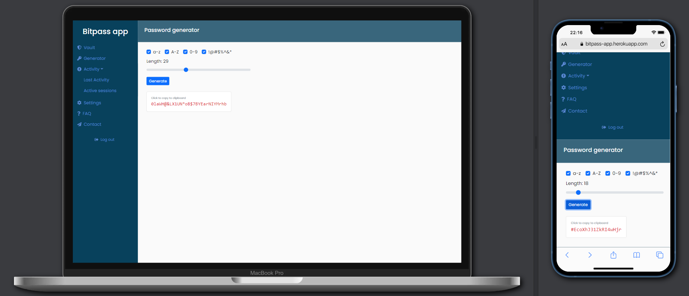

* Active sessions

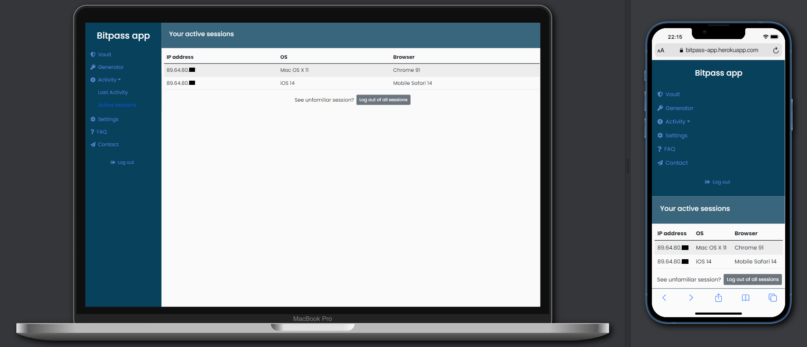

* Account activities

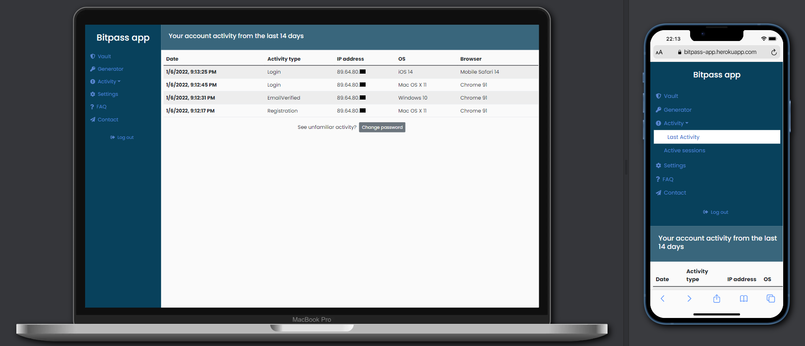

* Settings

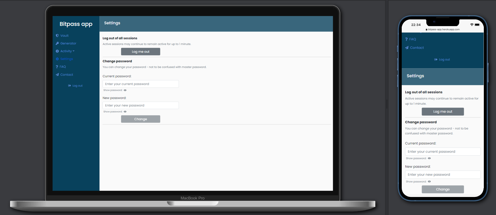

---
### License
Usage is provided under the [MIT License](http://opensource.org/licenses/mit-license.php). See LICENSE for the full details.
