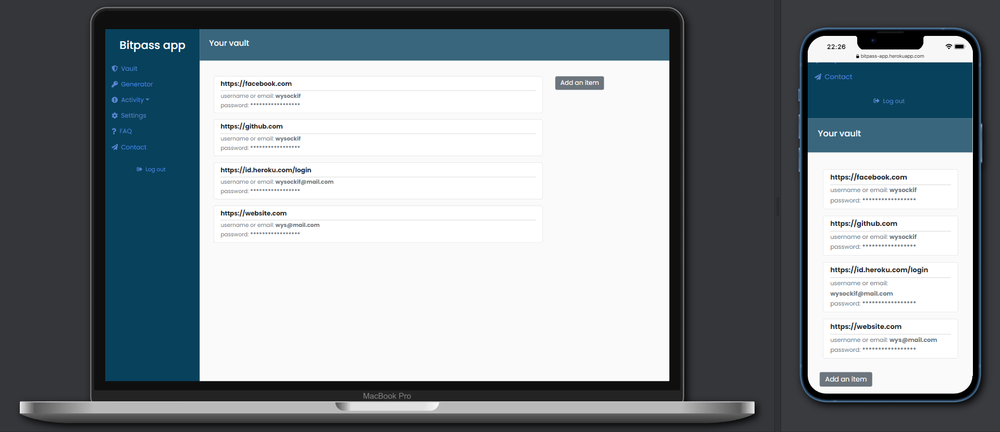
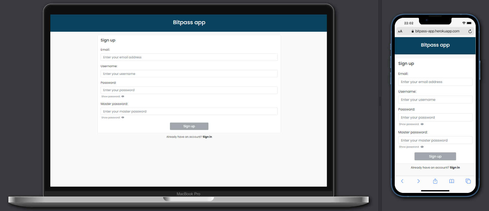
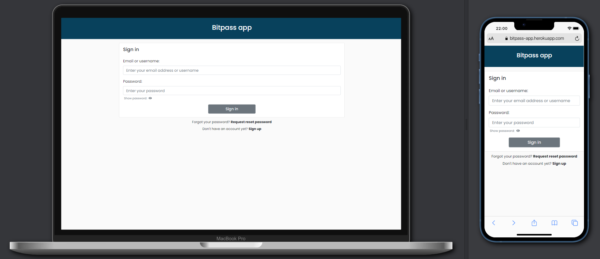
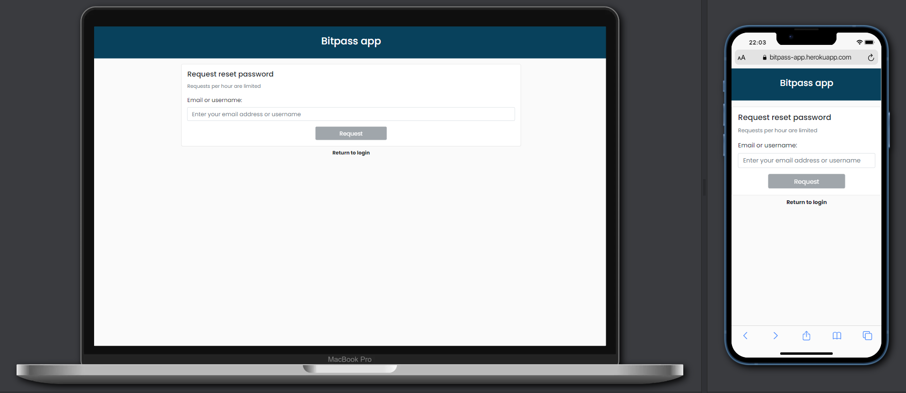
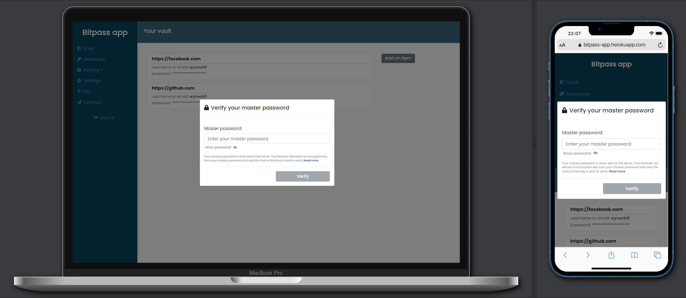
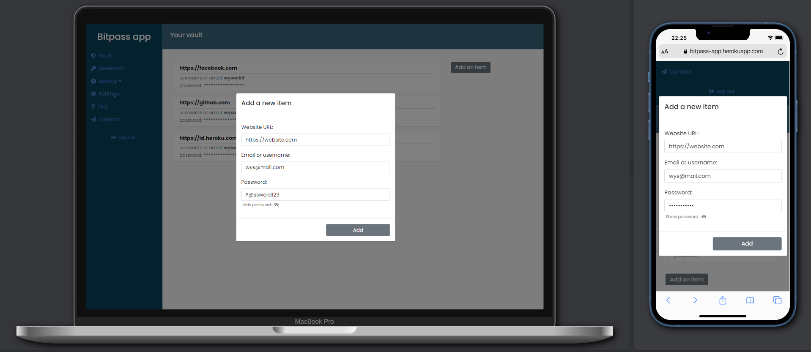
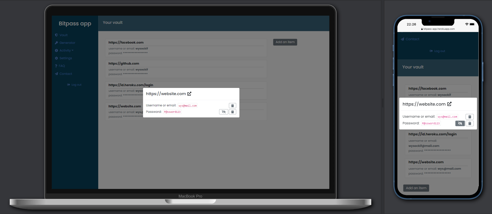
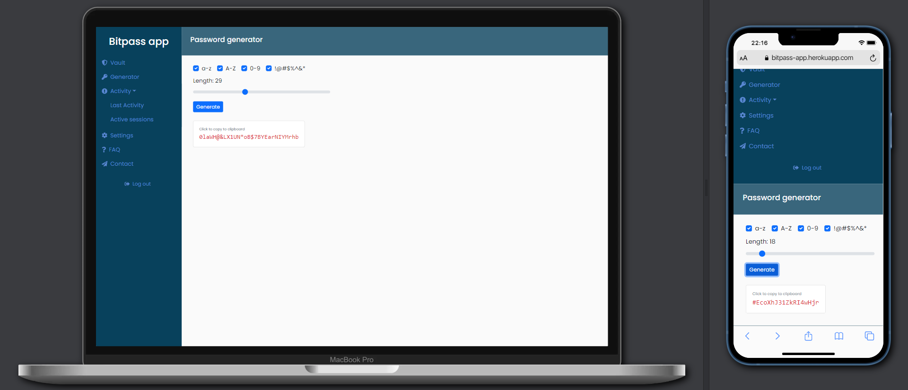
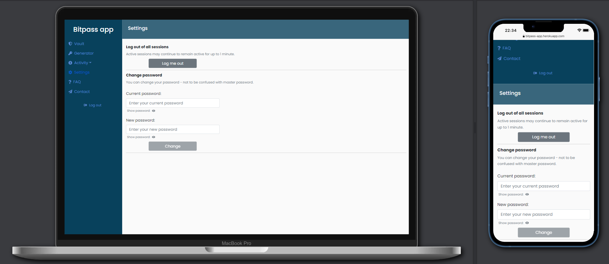

# BitPass

### General Information

Bitpass is an open source password manager.

---
### Used Technologies

1. Database:
- `PostgreSQL 13.2`
- `Heroku PostgreSQL 13.5`

2. Back-end:
- `C# 9`
- `.NET 5`

3. Front-end:
- `Typescript 4.1.2`
- `React.js 17.0.2`

4. DevOps:
- `Heroku`
- `Docker 20.10.11`
- `Docker Compose 2.2.1`

---

### Requirements

...
---

### Setup & usage

...

---
### Deployment

...

---
### Screenshots

* Sign up

* Sign in

* Request reset your password

* Verify your master password

* Add a new item

* Vault

* Reveal the password

* Password generator

* Settings

---

### Motivation & Project Status

Bitpass was created as my student project during the third year of studying Computer Science. It was my individual project for Data Protection in IT Systems subject.

The project was completed successfully.

Duration time: 01.12.2021 - 10-01-2022

---
### License
Usage is provided under the [MIT License](http://opensource.org/licenses/mit-license.php). See LICENSE for the full details.
